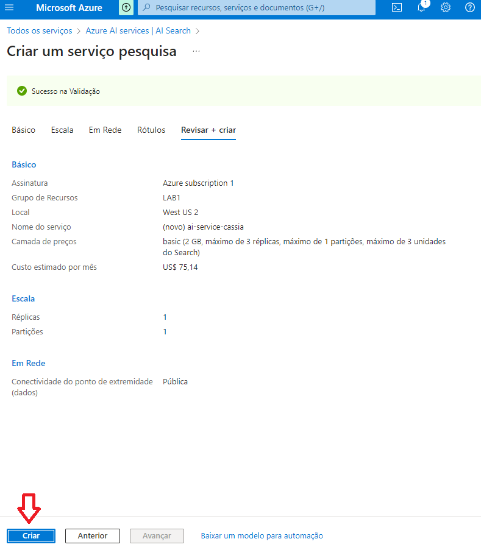
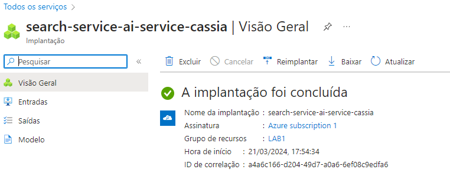
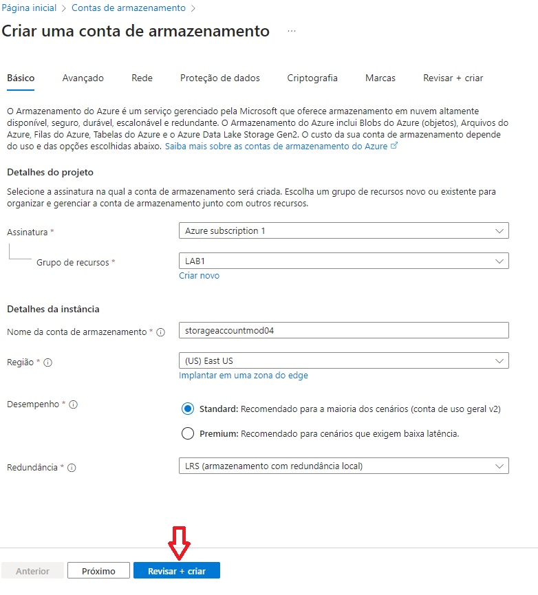
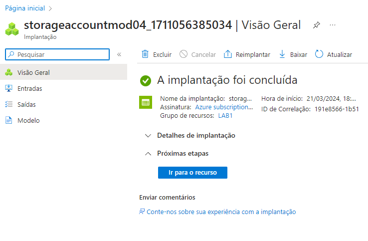
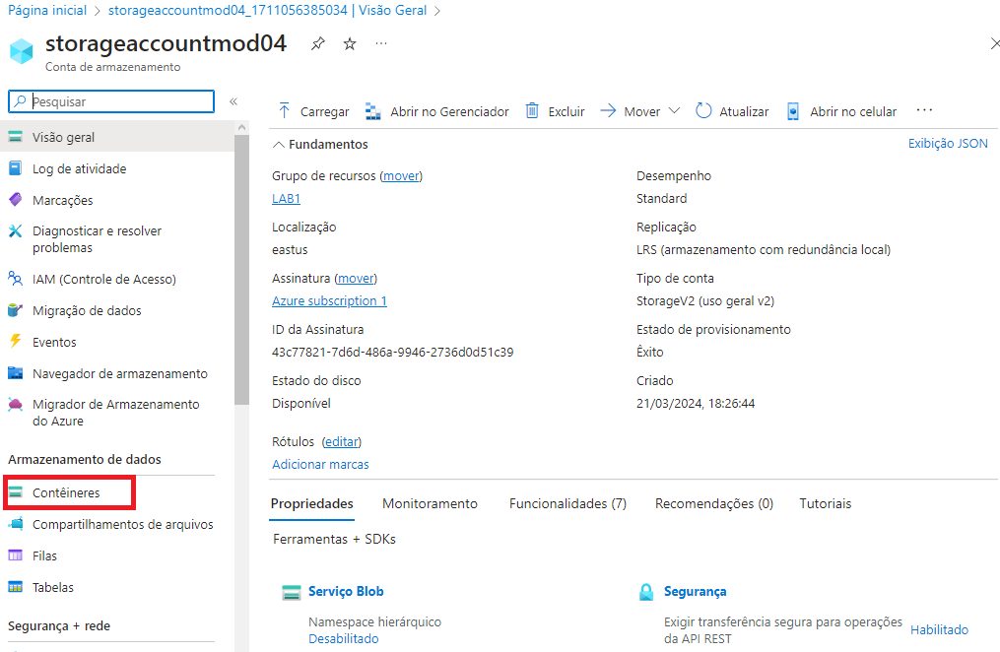
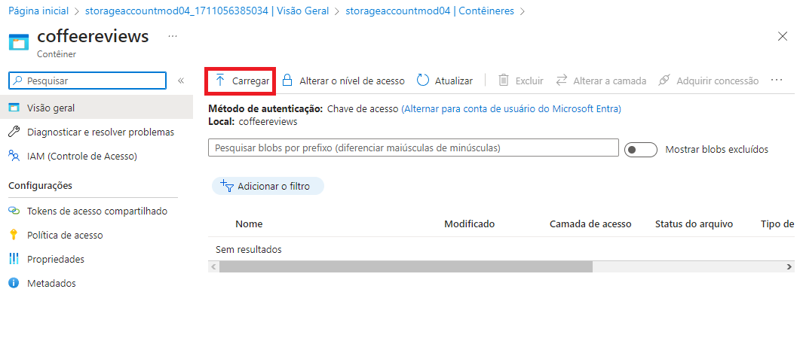
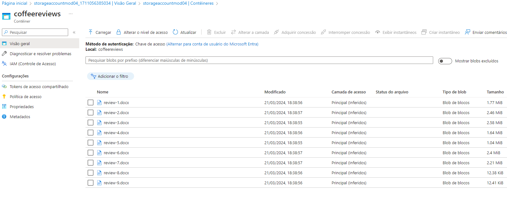
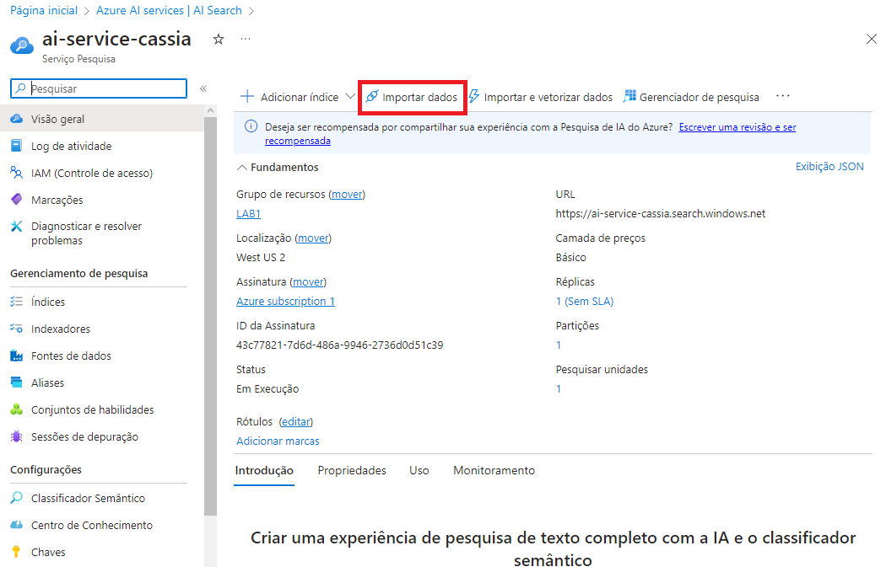

# AI-900: Azure Cognitive Search - Utilizando AI Search para Indexação e Consulta de Dados

## Objetivos de Aprendizado: 
- Entenda o que o Azure AI Document Intelligence faz e por que as organizações o utilizam.
- Descrever a mineração de conhecimento e os problemas que ela resolve.

## Inteligência de Documentos de IA do Azure

## Serviços de inteligência de documentos de IA
### Análise de documentos:
- Retorna representações de dados estruturados.
- Regiões de interesse e relacionamentos.
- Configurar opções de análise para análise gratuita e cobrada

1. Serviços de inteligência de documentos de IA:
Esses serviços utilizam inteligência artificial para processar e analisar documentos.

2. Análise de documentos:
A capacidade de analisar documentos de maneira eficiente e extrair informações relevantes.

3. Retorna representações de dados estruturados:
A capacidade de extrair dados organizados e estruturados a partir dos documentos, o que pode 
incluir informações como tabelas, listas ou outros formatos de dados estruturados.

4. Regiões de interesse e relacionamentos:
Identificação de áreas específicas nos documentos que são consideradas de interesse, bem como 
a análise de relacionamentos entre diferentes partes do conteúdo.

5. Configurar opções de análise para análise gratuita e cobrada:
Oferece opções de análise, onde pode haver uma versão gratuita com funcionalidades básicas e 
uma versão paga com recursos avançados. Isso implica em diferentes níveis de serviço, dependendo 
das necessidades e do orçamento do usuário.

## Modelos pré-construídos:
- Faturas
- Recibos
- Identificador
- Reconhece e extrai pares de valores-chave

## Modelos personalizados:
- Treine modelos com pelo menos cinco dados de amostra.
- Identifique campos de interesse para sua organização.

## Analisando formulários com o serviço Document Intelligence
- Extraia informações de formulários digitalizados em formato de imagem ou PDF.
- Use os modelos pré-treinados para tipos de documentos comuns, como faturas, recibos, IDs, etc.
- Treine um modelo personalizado usando seus próprios formulários.
- Use os modelos pré-treinados para tipos de documentos comuns, como faturas, recibos, IDs, etc.
- Treine um modelo personalizado usando seus próprios formulários
- Os modelos realizam reconhecimento semântico de campos de formulário – não apenas extração 
de texto

>>> Estúdio de Inteligência de Documentos
Usando uma abordagem sem código, você pode explorar a funcionalidade usando exemplos e seus
próprios documentos.
Primeiro - crie um recurso:
- Recurso de Inteligência de Documentos
- Recurso de serviços de IA
- Em seguida, habilite o recurso no Document Intelligence Studio.
- Página de primeiros passos: selecione um modelo para experimentar

## Pesquisa Cognitiva do Azure: O que é mineração de conhecimento?
- As organizações têm muito conteúdo
- Os dados são bloqueados em documentos, PDFs, notas manuscritas, etc.
- A mineração de conhecimento encontra insights – em escala.
-  O Azure Cognitive Search é a plataforma de mineração de conhecimento alimentada por IA do
Azure.

## Soluções de Pesquisa Cognitiva do Azure

1. Ingestão de dados
- Azure Blob Storage containers
- Azure Data Lake Storage Gen2
- Azure Table Storage

2. Enriquecimento e índice de IA
- Permite uma compreensão mais profunda
- Visão, Processamento de Linguagem Natural, etc.
- A indexação torna o conteúdo pesquisável

3. Explorar
- Pesquisa realizada em índices
- Dentro dos aplicativos
- Crie visualizações de dados

## Enriquecimento de IA
Pesquisa Cognitiva do Azure
O enriquecimento de IA torna o conteúdo mais útil para fins de pesquisa
O conteúdo enriquecido é criado por conjuntos  de habilidades como:
- Reconhecer entidades no texto
- Traduzir texto
- Avalie o sentimento

Um conjunto de habilidades produz documentos enriquecidos
- Consumido durante a indexação
- Os dados serializados são passados ao mecanismo de pesquisa para indexação

# Aplicação prática:

## Utilizando os recursos necessários do Azure

Para realizar este laboratório, foi necessário utilizar, no Portal do Azure, os 3 serviços abaixo:

- Azure AI Search: para gerenciará a indexação e a consulta;
- Um recurso de serviços de IA do Azure, que fornece serviços de IA para habilidades que sua solução de pesquisa pode usar para enriquecer os dados na fonte de dados com insights gerados por IA.

> - Os recursos do Azure AI Search e dos serviços Azure AI devem estar no mesmo local!

- Uma conta de armazenamento com contêineres de blobs, que armazenará documentos brutos e outras coleções de tabelas, objetos ou arquivos.

## Crie um recurso do Azure AI Search

1. Entre no portal do Azure.

2. Clique no botão + Criar um recurso, pesquise o Azure AI Search e crie um recurso do Azure AI Search com as seguintes configurações:

> - Assinatura: sua assinatura do Azure.
> - Grupo de recursos: selecione ou crie um grupo de recursos com um nome exclusivo.
> - Nome do serviço: um nome exclusivo.
> - Localização: Escolha qualquer região disponível.
> - Nível de preços: Básico

3. Selecione Revisar + criar e, depois de ver a resposta Validação bem-sucedida, selecione Criar.

4. Após a conclusão da implantação, selecione Ir para o recurso. Na página de visão geral do Azure AI Search, você pode adicionar índices, importar dados e pesquisar índices criados.

## Crie um recurso de serviços de IA do Azure
Você precisará ter um recurso de serviços de IA do Azure que esteja no mesmo local que seu recurso do Azure AI Search. Sua solução de pesquisa usará esse recurso para enriquecer os dados no armazenamento de dados com insights gerados por IA.

1. Retorne à página inicial do portal do Azure. Clique no botão ＋Criar um recurso e pesquise os serviços de IA do Azure. Selecione criar um plano de serviços de IA do Azure. Você será levado a uma página para criar um recurso de serviços de IA do Azure. Configure-o com as seguintes configurações:
> - Assinatura: sua assinatura do Azure.
> - Grupo de recursos: O mesmo grupo de recursos que o seu recurso Azure AI Search.
> - Região: O mesmo local que o seu recurso Azure AI Search.
> - Nome: Um nome exclusivo.
> - Nível de preços: Padrão S0
> - Ao marcar esta caixa, confirmo que li e compreendi todos os termos abaixo: Selecionado

2. Selecione Revisar + criar. Depois de ver a resposta Validação aprovada, selecione Criar.

3. Aguarde a conclusão da implantação e visualize os detalhes da implantação.

## Crie uma conta de armazenamento

1. Retorne à página inicial do portal do Azure e selecione o botão + Criar um recurso.

2. Procure a conta de armazenamento e crie um recurso de conta de armazenamento com as seguintes configurações:
> - Assinatura: sua assinatura do Azure.
> - Grupo de recursos: o mesmo grupo de recursos que os recursos do Azure AI Search e dos serviços Azure AI.
> - Nome da conta de armazenamento: um nome exclusivo.
> - Localização: Escolha qualquer local disponível.
> - Padrão de desempenho
> - Redundância: armazenamento localmente redundante (LRS)

3. Clique em Revisar e em Criar. Aguarde a conclusão da implantação e vá para o recurso implantado.

4. Na conta de Armazenamento do Azure que você criou, no painel de menu esquerdo, selecione Configuração (em Configurações).
5. Altere a configuração de Permitir acesso anônimo de Blob para Habilitado e selecione Salvar.

## Carregar documentos para o armazenamento do Azure
1. No painel de menu esquerdo, selecione Contêineres.

2. Selecione + Contêiner. Um painel do seu lado direito é aberto.
3. Insira as seguintes configurações e clique em Criar:
> - Nome: avaliações de café
> - Nível de acesso público: Container (acesso de leitura anônimo para containers e blobs)
> - Avançado: sem alterações.
4. Em uma nova guia do navegador, baixe as avaliações compactadas do café em https://aka.ms/mslearn-coffee-reviews e extraia os arquivos para a pasta de avaliações.
5. No portal do Azure, selecione o contêiner de avaliações de café. No contêiner, selecione Carregar.

6. No painel Carregar blob, selecione Selecionar um arquivo.

7. Na janela do Explorer, selecione todos os arquivos na pasta de avaliações, selecione Abrir e, em seguida, selecione Carregar.

8. Depois que o upload for concluído, você poderá fechar o painel Upload blob. Seus documentos estão agora em seu contêiner de armazenamento de avaliações de café.

## Indexar os documentos
Depois de armazenar os documentos, você poderá usar o Azure AI Search para extrair insights dos documentos. O portal do Azure fornece um assistente de importação de dados. Com este assistente, você pode criar automaticamente um índice e um indexador para fontes de dados suportadas. Você usará o assistente para criar um índice e importar seus documentos de pesquisa do armazenamento para o índice do Azure AI Search.

1. No portal do Azure, navegue até o recurso do Azure AI Search. Na página Visão geral, selecione Importar dados.

2. Na página Conectar-se aos seus dados, na lista Fonte de Dados, selecione Armazenamento de Blobs do Azure. Preencha os detalhes do armazenamento de dados com os seguintes valores:
> - Fonte de dados: Armazenamento de Blobs do Azure
> - Nome da fonte de dados: coffee-customer-data
> - Dados a extrair: Conteúdo e metadados
> - Modo de análise: Padrão
> - Cadeia de conexão: *Selecione Escolha uma conexão existente. Selecione sua conta de armazenamento, selecione o contêiner de avaliações de café e clique em Selecionar.
> - Autenticação de identidade gerenciada: Nenhuma
> - Nome do contêiner: esta configuração é preenchida automaticamente depois que você escolhe uma conexão existente.
> - Pasta Blob: deixe em branco.
> - Descrição: Avaliações sobre Fourth Coffee Shops.
3. Selecione Próximo: Adicionar habilidades cognitivas (opcional).

4. Na secção Anexar Serviços Cognitivos, selecione o seu recurso de serviços Azure AI.

5. Na seção Adicionar enriquecimentos:
> - Altere o nome da Skillset para coffee-skillset.
> - Marque a caixa de seleção Habilitar OCR e mesclar todo o texto no campo merged_content.

Nota É importante selecionar Habilitar OCR para ver todas as opções de campo enriquecido.

> - Certifique-se de que o campo Dados de origem esteja definido como merged_content.
> - Altere o nível de granularidade de enriquecimento para Páginas (blocos de 5.000 caracteres).
> - Não selecione Habilitar enriquecimento incremental
> - Selecione os campos enriquecidos de acordo com a documentação

6. Em Salvar enriquecimentos em um armazenamento de conhecimento, selecione:
> - Projeções de imagem
> - Documentos
> - Páginas
> - Frases chave
> - Entidades
> - Detalhes da imagem
> - Referências de imagem

7. Selecione projeções de blob do Azure: Documento. Uma configuração para o nome do contêiner com as exibições preenchidas automaticamente do contêiner de armazenamento de conhecimento. Não altere o nome do contêiner.

8. Selecione Próximo: Personalizar índice de destino. Altere o nome do índice para índice de café.

9. Certifique-se de que a chave esteja definida como metadata_storage_path. Deixe o nome do sugeridor em branco e o modo de pesquisa preenchido automaticamente.

10. Revise as configurações padrão dos campos de índice. Selecione filtrável para todos os campos que já estão selecionados por padrão.

11. Selecione Próximo: Criar um indexador.

12. Altere o nome do indexador para indexador de café.

13. Deixe a programação definida como Uma vez.

14. Expanda as opções avançadas. Certifique-se de que a opção Base-64 Encode Keys esteja selecionada, pois as chaves de codificação podem tornar o índice mais eficiente.

15. Selecione Enviar para criar a fonte de dados, o conjunto de habilidades, o índice e o indexador. O indexador é executado automaticamente e executa o pipeline de indexação, que:
Extrai os campos de metadados do documento e o conteúdo da fonte de dados.
Executa o conjunto de habilidades cognitivas para gerar campos mais enriquecidos.
Mapeia os campos extraídos para o índice.

16. Volte à página de recursos do Azure AI Search. No painel esquerdo, em Gerenciamento de pesquisa, selecione Indexadores. Selecione o indexador de café recém-criado. Espere um minuto e selecione &orarr; Atualize até que o 17.Status indique sucesso.

17. Selecione o nome do indexador para ver mais detalhes.

## Consultar o índice
Use o Search Explorer para escrever e testar consultas. O explorador de pesquisa é uma ferramenta incorporada no portal do Azure que oferece uma maneira fácil de validar a qualidade do seu índice de pesquisa. Você pode usar o Search Explorer para escrever consultas e revisar resultados em JSON.

1. Na página Visão geral do serviço de pesquisa, selecione Explorador de pesquisa na parte superior da tela.

2. Observe como o índice selecionado é o índice de café que você criou. Abaixo do índice selecionado, altere a visualização para JSON.

... 

### Links:

> - https://aka.ms/ai900-ai-search
> - https://learn.microsoft.com/en-us/training/paths/document-intelligence-knowledge-mining/